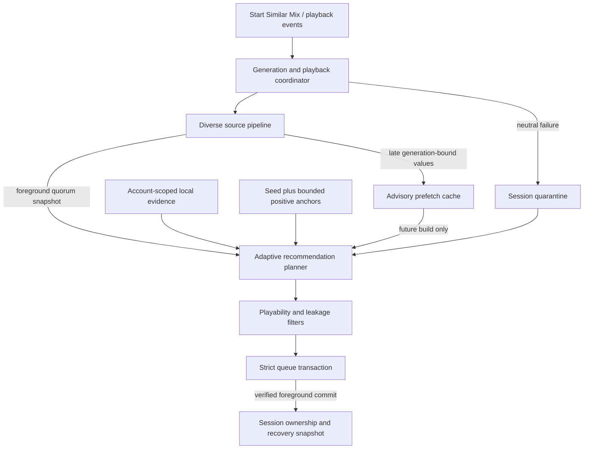
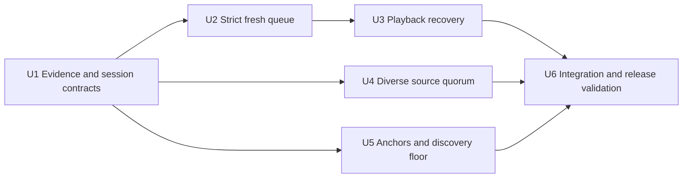

# Adaptive Similar Mix - Plan

## Goal Capsule

- **Objective:** Make Similar Mix self-healing, faster to start, strict about owning a freshly cleared queue, and progressively personalized without creating a musical echo chamber.
- **Authority:** User-directed automatic learning and discovery requirements outrank inferred implementation preferences. Documented Spicetify APIs outrank private client internals. Existing repository filtering and queue-safety rules remain mandatory.
- **Execution profile:** Six serial implementation units on one feature branch because queue state, session state, source scheduling, and ranking share runtime state.
- **Stop conditions:** Stop rather than claim success if a foreground queue commit cannot be verified, a playback failure cannot be distinguished from pause/buffering, or deterministic evaluation cannot prove the discovery floor.
- **Tail ownership:** Late source work and prefetched candidates are advisory. Only a foreground, generation-current, verified queue transaction may change Spotify queue ownership.

---

## Product Contract

### Summary

Similar Mix will learn each Spotify user's preferences from bounded implicit evidence while retaining meaningful discovery opportunities. It will also repair unplayable tracks, clear the previous queue when a new mix starts, and return a good initial slate as soon as diverse sources reach quorum.

### Problem Frame

The current v2 system already learns from early skips, substantial plays, and completions, but the runtime does not emit its existing neutral playback-failure observation. Queue verification accepts a short prefix, source discovery waits for slow work, and the late blend can become heavily profile-driven. These gaps cause visible playback failures, stale queue leakage, startup lag, and a risk of overfitting to familiar music.

### Key Decisions

- **Implement the four accepted stability and performance additions as one coherent upgrade.** (session-settled: user-directed — chosen over an incremental subset because the user selected items 1, 2, 3, and 4 together.) Governs R1-R14.
- **Learn automatically from local behavior without adding user controls.** (session-settled: user-directed — chosen over settings and manual tuning because the mix should evolve on its own.) Governs R9-R13.
- **Guarantee discovery-eligible music when supply exists.** (session-settled: user-directed — chosen over pure personalization because the user wants branching into genuinely unfamiliar music to remain possible.) Governs R14-R16.
- **Treat playback failures as operational evidence only.** (session-settled: user-approved — chosen over teaching a dislike because an unavailable track says nothing about musical preference.) Governs R1-R4.
- **Verify a fresh queue takeover with one bounded retry.** (session-settled: user-approved — chosen over accepting a prefix-only queue because the previous queue must be cleared.) Governs R5-R7.
- **Return on a diverse foreground source quorum and keep late work advisory.** (session-settled: user-approved — chosen over waiting for every source because slow sources should not hold the button response hostage.) Governs R8.
- **Keep the original seed dominant while recent positive tracks become secondary anchors.** (session-settled: user-approved — chosen over replacing the seed because an evolving session must not drift without bounds.) Governs R12-R13.

### Requirements

#### Playback self-healing

- R1. Detect a likely playback failure only for an extension-owned track using bounded progress, pause, buffering, media-type, and current-URI checks.
- R2. Classify a failed track as neutral, quarantine it for the active session, and never record it as a skip, play, repeat, completion, or positive anchor.
- R3. Coalesce duplicate or racing failure signals so one URI causes at most one queue repair and one conditional advance.
- R4. Rebuild the upcoming queue without the quarantined URI, verify the repair, and notify the user only when automatic recovery cannot leave a playable next track.

#### Queue ownership and startup stability

- R5. Starting a new Similar Mix must perform `detach context -> clear queue -> add queue -> settle and verify -> commit session` before showing success.
- R6. Verification must preserve requested order and reject prior or foreign URIs anywhere in the complete observable upcoming-queue snapshot, including entries after the requested prefix and delayed reinjection after an initially matching observation; a bounded post-commit integrity guard must repair or release ownership if context regeneration appears later.
- R7. A recoverable mismatch gets one bounded reinstall attempt; a second failure must not commit new session ownership or a misleading success notification, and a context-menu start that already changed playback must end cleanly instead of pretending the old session is intact.

#### Startup latency and source resilience

- R8. Foreground discovery must return after 75 unique valid candidate URIs arrive from at least three sources, including one high-affinity source and one breadth source, or after a 4.5-second foreground deadline with the best degraded snapshot; unfinished work stays bounded, generation-scoped, and unable to mutate the live queue.

#### Private adaptive learning

- R9. Store implicit taste evidence locally, per account when a stable identity is available, with bounded size, decay, schema migration, corruption recovery, and a per-install fallback.
- R10. Treat completion as strong positive evidence, substantial play as medium positive evidence, early skip as negative evidence, and repeat listening as diminishing additional positive evidence.
- R11. Use Spotify top-track, library, and history inputs as weak familiarity or affinity priors; API or storage failure must never interrupt playback.
- R12. Keep the selected seed and selected context authoritative while up to three distinct recent substantial or completed tracks contribute bounded secondary-anchor influence.
- R13. Apply positive learning to future refill and prefetch decisions; keep immediate reranking for negative feedback and never churn the protected visible queue head after a positive play.

#### Protected discovery and recommendation quality

- R14. Select at least four discovery-eligible candidates that are absent from bounded familiarity evidence in each rolling ten-track window whenever four eligible candidates exist, and cap familiarity-observed selections at six in that window across initial planning, refill, rerank, repair, and reload boundaries.
- R15. When supply cannot meet R14, select every eligible discovery candidate and emit a `relax:discovery-floor` diagnostic instead of silently abandoning the rule or producing an empty slate.
- R16. Discovery and secondary-anchor candidates must still pass playability, artist/album spacing, acoustic pacing, vocal-seed instrumental filtering, and soundtrack leakage protection.

### Key Flows

- F1. Fresh Similar Mix takeover
  - **Trigger:** The user selects Start Similar Mix or refreshes from the current track.
  - **Steps:** The engine invalidates older generations, prepares a foreground slate, detaches the old context when supported, clears and installs the queue, observes two stable public queue snapshots, and then commits the session.
  - **Outcome:** No observed prior queue item is accepted as owned, only the newest request shows success, and the integrity guard repairs or releases ownership after later reinjection.
  - **Covered by:** R5-R8.
- F2. Owned-track playback recovery
  - **Trigger:** An owned music track changes in but produces no credible playback progress within the watchdog budget.
  - **Steps:** The coordinator rules out pause, buffering, seeking, unsupported media, a context exit, and an already-completed song change; it records neutral failure, quarantines the URI, repairs the queue, and advances only if the failed URI remains current.
  - **Outcome:** Playback continues without poisoning taste learning or creating a retry loop.
  - **Covered by:** R1-R4.
- F3. Adaptive refill
  - **Trigger:** A track receives substantial or complete listening evidence, the queue reaches refill depth, or a new mix starts.
  - **Steps:** The profile records bounded account-scoped evidence, derives weighted anchors, merges any valid advisory candidates, and plans a deterministic slate with the discovery floor.
  - **Outcome:** The mix evolves while the seed and discovery allocation remain protected.
  - **Covered by:** R9-R16.

### Acceptance Examples

- AE1. Failure and skip race
  - **Covers:** R1-R4.
  - **Given:** An owned queued track becomes current but cannot start.
  - **When:** A failure decision and a `songchange` arrive in either order.
  - **Then:** The track is quarantined once, creates no taste/history/anchor signal, and causes no more than one conditional advance.
- AE2. Delayed old-context reinjection
  - **Covers:** R5-R7.
  - **Given:** Spotify briefly reports the requested prefix and later appends an old queue URI.
  - **When:** fresh-mix verification samples the queue twice.
  - **Then:** The first attempt is rejected, one reinstall occurs, and session ownership commits only after two stable clean observations.
- AE3. Slow source after quorum
  - **Covers:** R8.
  - **Given:** Diverse sources have returned enough unique candidates while another source is slow.
  - **When:** the foreground quorum is satisfied.
  - **Then:** initial planning completes without waiting for the slowest timeout, and its eventual values cannot mutate the active queue.
- AE4. Mature narrow profile
  - **Covers:** R9-R16.
  - **Given:** A listener repeatedly completes a narrow artist and genre cluster.
  - **When:** a ten-track window is planned with enough discovery-eligible candidates.
  - **Then:** learned affinity changes ordering, but at least four candidates absent from bounded familiarity evidence remain and repository leakage filters still apply.
- AE5. Cold start and degraded APIs
  - **Covers:** R8-R16.
  - **Given:** No local profile exists and profile/top-track APIs fail.
  - **When:** the user starts a mix from a track.
  - **Then:** seed-driven hybrid discovery still produces the best bounded slate without blocking playback.

### Success Criteria

- A controlled source-pipeline test proves foreground completion is governed by the 75-candidate, three-source, two-role quorum or the 4.5-second degraded deadline rather than the slowest task.
- Deterministic quality evaluation proves a 40% discovery-eligible floor in every eligible ten-track window; genuine unfamiliarity remains the intended user outcome, not an observable guarantee.
- Queue tests prove stale-tail rejection, two-observation settling, exactly one retry, and no ownership commit on persistent mismatch.
- Playback tests prove pauses, buffering, seeks, foreign media, duplicate events, and already-advanced tracks cannot trigger false quarantine or double skip.
- Full tests, typecheck, build, local Spicetify apply, and a live Start Similar Mix -> first skip -> refill smoke test complete without a client playback error.

### Scope Boundaries

- Learning remains invisible and automatic. No preferences panel, sliders, or manual profile training are added.
- Detailed skip, repeat, and completion learning occurs only inside owned Similar Mix playback. General account taste enters through weak top-track/library/history priors.
- No cloud telemetry or remote profile database is introduced.
- Private `PlayerAPI.updateContext` remains optional and feature-detected. Queue correctness cannot depend solely on it.
- Unsupported Spotify recommendation, audio-feature, popularity, genre, or cancellation capabilities remain optional. Their absence must degrade gracefully.

---

## Planning Contract

### Key Technical Decisions

- KTD1. **Use a conservative event-driven playback watchdog.** Arm after an owned music-track transition, observe `songchange`, `onplaypause`, progress, and inferred Player state, tolerate bounded buffering, and decide failure only after multiple consistent signals. Spicetify exposes no documented playback-error event. Implements R1-R4.
- KTD2. **Serialize playback transitions through a failure ledger.** Session state owns a per-URI quarantine and recovery-in-flight guard so failure and song-change ordering cannot double-teach or double-advance. Implements R2-R4.
- KTD3. **Separate fresh takeover from ordinary reranking.** Fresh starts use strict raw ordered queue verification, one retry, and a bounded post-commit integrity guard; feedback reranks retain their existing verified replacement and rollback posture. A failed context-menu start safely tears down extension ownership when public APIs cannot restore the prior playback context. Implements R5-R7.
- KTD4. **Use public queue mutation APIs as the ownership boundary.** `clearQueue`, `addToQueue`, and public `Queue.nextTracks` observations are primary. Private context detachment is guarded assistance only. Implements R5-R7.
- KTD5. **Make quorum snapshot-based rather than cancellability-dependent.** Stop launching unnecessary tasks, retain capacity until in-flight Cosmos work settles, and discard obsolete results by generation because CosmosAsync cannot reliably abort requests. Implements R8.
- KTD6. **Namespace learning by account identity with a safe fallback.** Resolve identity within a bounded timeout. A successful identity may claim the legacy profile exactly once through a durable claim marker; an offline fallback remains in a separate installation namespace and is never silently merged. Account changes invalidate active stores before another read or write. Implements R9-R11.
- KTD7. **Extend the existing taste profile rather than create a parallel evidence store.** Keep unique familiarity history for exclusions and add bounded timestamped per-track counts to the account-scoped taste schema for repeats and most-listened strength with diminishing returns. Implements R9-R11.
- KTD8. **Blend anchor affinities explicitly.** The original seed owns at least 60% of anchor influence; up to three recent positive anchors share at most 40%, and context-mode authority remains intact. An unweighted `referenceTracks` list is insufficient. Implements R12-R13.
- KTD9. **Enforce discovery with a session ledger.** Familiarity is listener-specific. Persist the last nine committed familiarity classifications and use them when every initial plan, refill, rerank, repair, and recovery window reserves four discovery-eligible candidates before taste score fills the remaining positions. Implements R14-R16.

### High-Level Technical Design

### System-Wide Impact

- **Data lifecycle:** Taste and listening evidence become account-scoped, versioned, bounded by the existing 512 KiB profile ceiling and signal caps, and recoverable from malformed storage. Recovery snapshots gain up to three anchors and nine committed familiarity classifications.
- **Concurrency:** A single queue-mutation coordinator serializes fresh starts, playback repairs, feedback reranks, refills, foreign-injection cleanup, and manual reshuffles. Each mutation carries a generation or session revision, and stale operations exit before mutation, verification, rollback, or ownership commit.
- **Performance:** Foreground startup stops at a diverse candidate quorum. Late work cannot retain queue ownership authority.
- **Compatibility:** The installed Spotify client is newer than the supported range published for local Spicetify 2.44.0, so private API use stays guarded and non-essential.
- **Recommendation integrity:** Discovery allocation joins artist, album, acoustic, vocal, soundtrack, and playability constraints as a slate invariant.

### Sequencing

### Risks and Dependencies

- The Player state contract is inferred and may change. The watchdog must fail closed and never quarantine during ambiguous pause or buffering states.
- Public queue observation may hydrate partially. Verification must compare only a justified visible window, require stability, and remain bounded.
- CosmosAsync requests may outlive the foreground caller. Capacity accounting and generation checks must prevent leaks and stale mutation.
- Spotify API capabilities and quotas can vary by account. Optional profile priors must not become startup dependencies.
- Account identity lookup may fail offline. The per-install fallback must preserve playback while preventing accidental repeated migrations.

### Research

- Spicetify documents `songchange`, `onplaypause`, and `onprogress`, but no playback-error event: [Player API](https://spicetify.app/docs/development/api-wrapper/methods/player).
- Spicetify documents `clearQueue`, `addToQueue`, and `play` as PlayerAPI mutations: [Platform API](https://spicetify.app/docs/development/api-wrapper/methods/platform).
- Queue observations are inferred and may change: [Queue property](https://spicetify.app/docs/development/api-wrapper/properties/queue).
- Spotify Top Items provides short-, medium-, and long-term affinity windows: [Get User's Top Items](https://developer.spotify.com/documentation/web-api/reference/get-users-top-artists-and-tracks).
- Spotify Recently Played provides bounded account history: [Get Recently Played Tracks](https://developer.spotify.com/documentation/web-api/reference/get-recently-played).

---

## Implementation Units

### U1. Account-scoped evidence and session state

- **Goal:** Establish neutral failure state, bounded listening evidence, repeat semantics, and weighted anchor contracts before consumers change.
- **Requirements:** R2, R3, R9-R13.
- **Files:** `src/profile/tasteProfile.ts`, `src/profile/tasteProfile.test.ts`, `src/storage/settings.ts`, `src/session/SessionManager.ts`, `src/session/SessionManager.test.ts`, `src/services/sessionRecovery.ts`, `src/services/sessionRecovery.test.ts`, `src/sources/profileTracks.ts`, and its tests.
- **Approach:** Version and account-namespace the existing taste profile, then add bounded per-track counts and timestamps instead of a second store. Resolve identity with a bounded timeout; allow one account to claim legacy state exactly once; keep offline fallback state isolated; and invalidate stores on account change. Add quarantine, recovery-in-flight, playback-confirmation, and recent-positive-anchor state. Preserve the existing taste confidence gates and bounded multiplier. Record repeat evidence only from another valid substantial/completed observation, with per-track and per-artist diminishing caps. Fetch Recently Played through the existing bounded best-effort profile adapter and use its URIs only as weak familiarity evidence.
- **Test scenarios:** Cold start; malformed legacy storage; account change; offline identity fallback; duplicate progress events; same-URI replay versus duplicate event; failure neutrality; anchor cap and seed dominance; recovery snapshot migration.
- **Verification:** Run focused profile, session, and recovery tests plus `npm run typecheck`.

### U2. Strict fresh-mix queue transaction

- **Goal:** Clear the previous queue on every new mix path and commit ownership only after a stable clean observation.
- **Requirements:** R5-R7.
- **Files:** `src/queue/queueManager.ts`, `src/queue/queueManager.test.ts`, a focused queue-mutation coordinator and tests, `src/services/shuffleEngine.ts`, relevant service tests.
- **Approach:** Preserve the current dirty `replaceUpcomingQueueForNewMix()` work. Add a raw ordered queue reader and strict verifier over the complete observable snapshot. Route fresh takeover, playback repair, feedback rerank, refill, foreign-injection cleanup, and manual reshuffle through one generation-aware mutation lane. Route both context-menu seed playback and current-track replacement through a serialized fresh transaction. Require two consecutive clean snapshots, retry the full detach-clear-add sequence once, and keep session commit inside `liveMixCoordinator.commit()`. After commit, observe queue revisions for a bounded settling window and run one repair before releasing ownership on persistent reinjection. If a context-menu failure occurs after seed playback begins, end extension ownership and report failure; do not claim the old session survived.
- **Test scenarios:** Clean first attempt; delayed foreign tail after a valid prefix; second-attempt success; persistent reinjection; partial hydration; duplicate input; empty prior queue; two concurrent starts; stale refill or repair during verification; context-menu safe teardown; playbar rollback.
- **Verification:** Run `src/queue/queueManager.test.ts`, affected service tests, and `npm run typecheck`.

### U3. Neutral playback-failure watchdog and recovery

- **Goal:** Recover automatically from an owned unplayable track without false positives or taste pollution.
- **Requirements:** R1-R4.
- **Files:** `src/feedback/playbackObserver.ts`, `src/app.tsx`, a new focused watchdog module and tests, `src/session/SessionManager.ts`, `src/services/recommendationExclusions.ts`, `src/services/shuffleEngine.ts`, affected tests.
- **Approach:** Add a conservative event-driven watchdog with injectable clock/state for deterministic tests. Confirm playback before advancing durable history. On failure, serialize against song changes, quarantine the URI, invalidate prefetch, rerank/refill through the verified queue primitive, and call next only if the failed URI remains current after repair. Default to observation-only logging until a reproducible live failure, pause, and buffering calibration validates the activation thresholds on the installed client; do not claim self-healing is active before that gate passes.
- **Test scenarios:** Zero-progress failure; buffering extension; intentional pause; seek; ad/podcast/local/foreign playback; failure/songchange races; duplicate events; last-track refill; repaired queue but already advanced; persistent recovery failure.
- **Verification:** Run focused observer/watchdog/session/exclusion/engine tests and `npm run typecheck`.

### U4. Diverse source quorum and advisory late results

- **Goal:** Reduce initial mix latency without reducing source diversity or allowing detached work to mutate live state.
- **Requirements:** R8.
- **Files:** `src/sources/sourcePipeline.ts`, `src/sources/sourcePipeline.test.ts`, `src/sources/similarTracks.ts`, `src/sources/profileTracks.ts`, source tests, `src/services/prefetchCache.ts`, `src/services/shuffleEngine.ts`.
- **Approach:** Return at 75 unique valid URIs from at least three sources with one high-affinity role (`recommendations`, `inspired-by`, or `radio`) and one breadth role (`genre-era`, `era`, or `related-artists`), or at a 4.5-second deadline with the best degraded snapshot. Stop launching excess work after quorum. Keep already-running work tracked until settlement, record circuit health, and publish useful late values only through a bounded seed/context/generation cache. Apply the same foreground deadline to profile sampling so it cannot erase the similar-source latency gain.
- **Test scenarios:** Quorum before slow timeout; homogeneous fast sources do not satisfy quorum; all-degraded fallback; shared concurrency remains bounded; unsupported abort; late success/error; obsolete generation discard; later build may consume valid cache only.
- **Verification:** Run source and prefetch tests, a controlled latency assertion, and `npm run typecheck`.

### U5. Weighted anchors and hard discovery floor

- **Goal:** Make each session evolve from implicit taste while guaranteeing meaningful discovery opportunities from candidates absent from bounded familiarity evidence.
- **Requirements:** R10-R16.
- **Files:** `src/algorithm/recommendationPlannerV2.ts`, `src/algorithm/recommendationPlannerV2.test.ts`, `src/algorithm/rankingV2.ts`, `src/algorithm/rankingV2.test.ts`, `src/algorithm/progressiveBlend.ts`, `src/storage/settings.ts`, `src/evaluation/recommendationQuality.test.ts`, `src/services/shuffleEngine.ts`.
- **Approach:** Pass explicit seed and secondary-anchor weights into affinity scoring. Build familiarity from account-scoped local evidence, current session, top tracks, Recently Played, liked tracks, and profile-pool URIs. Maintain a session/recovery ledger of the last nine committed familiarity classifications and enforce four discovery-eligible choices per rolling ten across batch boundaries when eligible supply exists. Record requested, achieved, and relaxed metrics, and cap late profile blend so taste cannot bypass the floor. Positive feedback affects future tail/refill planning; early skips remain immediate.
- **Test scenarios:** Mature narrow profile; cold start; repeated favorite; anchor drift; thin discovery pool; deterministic replay; missing familiarity metadata; playlist/artist authority; vocal and soundtrack filters; artist/album/acoustic constraints.
- **Verification:** Run algorithm and recommendation-quality suites and confirm deterministic discovery metrics.

### U6. Integrated validation and release readiness

- **Goal:** Prove the combined runtime behavior and prepare the requested release without overstating live verification.
- **Requirements:** R1-R16.
- **Files:** Integration tests, `README.md`, `CHANGELOG.md`, `package.json`, release metadata as required by the repository.
- **Approach:** Add cross-feature regression scenarios, document automatic private learning and discovery safeguards, run the full quality gates, build the installed extension, apply it locally, and perform live Spotify queue/playback smoke tests. Only then update the release version and publish through the repository's existing release workflow.
- **Test scenarios:** New mix while old late work runs; first-track failure during takeover; immediate skip after takeover; reload with anchors; repeat-heavy profile; profile API failure; malformed storage; playbar retry failure with old session intact; context-menu retry failure with safe extension teardown.
- **Verification:** Run the complete Verification Contract and inspect the final staged diff before commit, tag, push, and release creation.

---

## Verification Contract

| Gate | Command or action | Units | Done signal |
|---|---|---|---|
| Focused unit tests | `npx vitest run <affected-test-files>` | U1-U5 | Every changed contract has deterministic positive, negative, and race coverage. |
| Full test suite | `npm test` | U1-U6 | All tests pass with no unhandled async work. |
| Static types | `npm run typecheck` | U1-U6 | TypeScript exits successfully. |
| Installed extension build | `npm run build` | U6 | The configured Spicetify extension output is rebuilt successfully. |
| Local application | `spicetify apply` | U6 | Spicetify applies the rebuilt extension without error. |
| Live fresh takeover | Start from playlist, artist, album, and track with an old queue | U2, U6 | The old queue does not reappear and only the newest mix owns the queue. |
| Live failure calibration | Exercise reproducible unavailable-track, intentional-pause, and buffering paths with watchdog traces | U3, U6 | Activation thresholds distinguish all three paths; otherwise the watchdog remains observation-only and the release does not claim active self-healing. |
| Discovery evaluation | `npm test -- src/evaluation/recommendationQuality.test.ts` | U5, U6 | Every eligible ten-track window meets 4 discovery-eligible tracks or records a justified relaxation. |
| Release validation | Repository release workflow and GitHub checks | U6 | Version, changelog, tag, pushed commit, and release artifact agree; CI is green. |

---

## Definition of Done

- R1-R16 are traced to passing automated tests and no launch-blocking question remains.
- Fresh starts clear and strictly verify the prior queue on both context-menu and playbar paths.
- A playback failure is neutral, session-quarantined, one-shot recovered, and unable to create an early-skip race.
- Foreground source latency is bounded by diverse quorum while late work remains advisory and generation-safe.
- Learning is automatic, local, account-isolated where possible, bounded, decayed, and resilient to storage or API failure.
- The original seed remains dominant, recent positive anchors influence future planning, and mature profiles cannot defeat the discovery floor.
- Existing vocal-seed instrumental filtering, soundtrack leakage protection, playability checks, and spacing constraints still pass.
- Full tests, typecheck, build, local apply, and live smoke checks are recorded with a clear boundary between automated and live evidence.
- Abandoned experimental paths, unused compatibility branches, debug logging, and dead test fixtures are removed from the final diff.
- The requested GitHub release is created only after the implementation and release validation gates pass.
